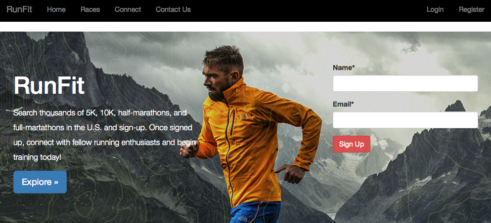

# WebApp

- Displayed below is the landing page for a fictitious Web Application developed through Django, a Python Web framework. This WebApp is still in development mode. The goal of this page is to have users search for races, from 5Ks all the way to full-marathons, and register for the one they want to participate in. Also, the idea is to allow users to communicate with other runners to share results and training regimens. 



### Python Frameworks:

- `Python 2.7`
- `Django==1.9.6`
- `django-crispy-forms==1.6.0`
- `django-registration-redux==1.4`

### Running the Server:

- First cd into the main directory and then use the following command in the terminal to run the server:

``` 
python manage.py runserver
```
